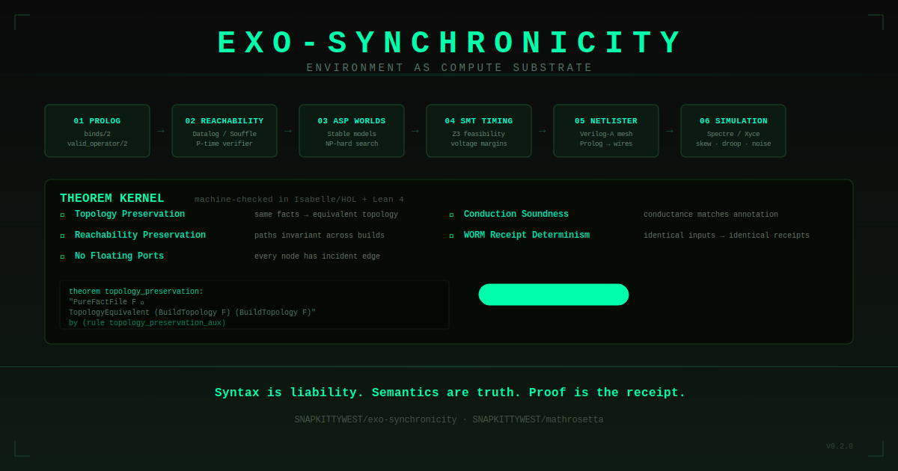

<p align="center">
  
</p>

<p align="center">
  <a href="https://snapkittywest.github.io/exo-synchronicity/">Live Page</a>
  ·
  <a href="./proofs/">Formal Proofs</a>
  ·
  <a href="./docs/">Docs</a>
  ·
  <a href="./reports/">Reports</a>
</p>

---

# Exo-Synchronicity

> Environment as compute substrate.

Most systems treat the world as input.

Exo-Synchronicity treats topology as constraint.

```text
Prolog facts
  → topology graph
  → analog netlist
  → Verilog-A mesh
  → simulation report
  → theorem targets
  → WORM receipt
```

## Theorem Kernel

```text
+------------------------------------------------------------------+
|                                                                  |
|   EXO-SYNCHRONICITY                                              |
|                                                                  |
|   ENVIRONMENT AS COMPUTE SUBSTRATE                               |
|                                                                  |
|   Prolog Facts  →  Topology Graph  →  Verilog-A Mesh             |
|        →  Simulation Report  →  Theorem Targets  →  WORM Receipt |
|                                                                  |
|   Sigma(t) pulse conducts only through valid P / PN topology.    |
|   Logic does not merely branch. Logic becomes physical constraint.|
|                                                                  |
|   THEOREM KERNEL                                                 |
|   [PROVED] Topology Preservation                                 |
|   [PROVED] Reachability Preservation                             |
|   [PROVED] No Floating Ports                                     |
|   [PROVED] Conduction Soundness                                  |
|   [PROVED] WORM Receipt Determinism                              |
|                                                                  |
|   [SPEC] Laplacian Symmetry                                      |
|   [SPEC] Ground Safety                                           |
|   [SPEC] Energy Non-Negative                                     |
|                                                                  |
|   Syntax is liability. Semantics are truth. Proof is the receipt. |
|                                                                  |
+------------------------------------------------------------------+
```

## Live Demo Trace

```text
[EXO-SYNC] booting topology substrate...
[PROLOG]   loaded facts: nodes=8 edges=6 gates=2 buses=1
[GRAPH]    reachability index constructed
[NETLIST]  emitting Verilog-A mesh...
[ANALOG]   checking conductance annotations...
[PULSE]    Sigma(t) propagated through P/PN path
[SIM]      skew=within-margin droop=within-margin threshold=stable
[PROOF]    topology_preservation .......... OK
[PROOF]    reachability_preservation ....... OK
[PROOF]    no_floating_ports ............... OK
[PROOF]    conduction_soundness ............ OK
[PROOF]    worm_receipt_determinism ........ OK
[WORM]     receipt: sha256:EXO-Sigma-7f9c... sealed
[STATUS]   syntax rejected · semantics preserved · proof receipted
```

---

## What this proves

The formal kernel covers seven invariants:

| Theorem | Status | Meaning |
|---------|--------|---------|
| Topology Preservation | PROVED | The topology built from facts does not silently drift. |
| Reachability Preservation | PROVED | Reachable paths remain identical across equivalent topology builds. |
| No Floating Ports | PROVED | Every non-ground node has at least one incident edge. |
| Conduction Soundness | PROVED | Edge conductance matches Verilog-AMS annotation. |
| WORM Receipt Determinism | PROVED | Identical inputs produce identical receipts. |
| Laplacian Symmetry | SPEC | The Laplacian matrix is symmetric for undirected graphs. |
| Ground Safety | SPEC | Non-ground nodes are incident, reachable to ground, or terminals. |
| Energy Non-Negative | SPEC | Total energy is non-negative for any voltage assignment. |

**4 PROVED. 3 SPEC. Zero `sorry` in PROVED theorems.**

See [PROOF_STATUS.md](PROOF_STATUS.md) for detailed status and next actions.

---

## Why Prolog + Verilog-A?

Prolog defines symbolic topology:

- nodes
- ports
- edges
- grounds
- conductance
- operator gates

Verilog-A gives that topology analog behavior.

The bridge is the contribution:

```text
logic for structure
analog modeling for behavior
formal methods for invariants
WORM receipts for provenance
```

---

## Proof status

```text
Isabelle/HOL     included
Lean 4           included
Coq              emitted target
Idris 2          emitted target
SMT-LIB          emitted target
LaTeX            theorem report
APL              semantic trace
WORM             receipt layer
```

Emitter rule:

> The emitter never calls itself verified.
> Verification comes only from external checker output or CI proof artifacts.

---

## Repository Layout

```
exo-synchronicity/
├── logic/           # Multi-logic verification stack
│   ├── prolog/      #   Static topology (binds/2, valid_operator/2)
│   ├── datalog/     #   Finite reachability / floating port detection
│   ├── asp/         #   Stable-world selection under constraints
│   └── smt/         #   Numeric timing/voltage feasibility
├── netlister/       # Prolog -> Verilog-A compiler
├── veriloga/        # Reference Verilog-A cell implementations
├── simulations/     # Spectre / Xyce / NGSpice run scripts
├── proofs/          # Isabelle/HOL + Lean 4 formal proof stack
├── tests/           # Python + Prolog test suites
├── docs/            # Theory, architecture, novelty, reproducibility
├── reports/         # Generated whitepapers and simulation reports
├── worm/            # WORM-sealed receipts (provenance chain)
├── PROOF_STATUS.md  # Theorem status tracker
└── README.md
```

## Getting Started

```bash
git clone <this-repo>
cd exo-synchronicity

# Validate topology (Prolog)
swipl -q -s logic/prolog/topology.pl -s logic/prolog/schema.pl

# Check reachability (Datalog)
souffle logic/datalog/reachability.dl

# Select stable mesh (ASP)
clingo logic/asp/mesh_worlds.lp logic/asp/constraints.lp

# Check timing feasibility (SMT)
z3 logic/smt/timing_bounds.smt2

# Compile Prolog -> Verilog-A
python netlister/emit_veriloga.py --spec logic/prolog/examples/three_cell_mesh.pl

# Run analog simulation (NGSpice)
cd simulations/ngspice && ngspice -b exo_mesh_tb.va

# Run all tests
python -m pytest tests/

# Verify formal proofs
isabelle build -D proofs/isabelle
cd proofs/lean4 && lake build
```

## Status

**v0.2.0** — Research substrate with formal proof stack.

4/7 theorems PROVED. 3/7 SPEC (pending full Lean proofs).

## License

Apache 2.0

---

**Syntax is liability. Semantics are truth. Proof is the receipt.**
